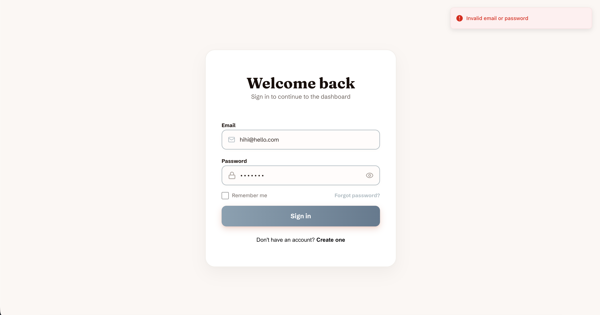
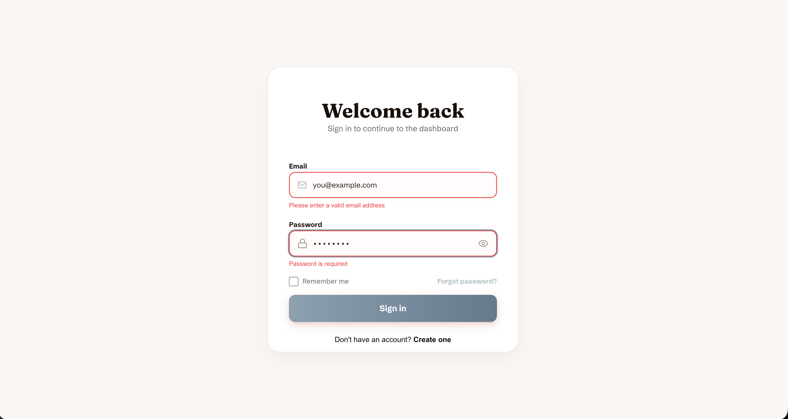
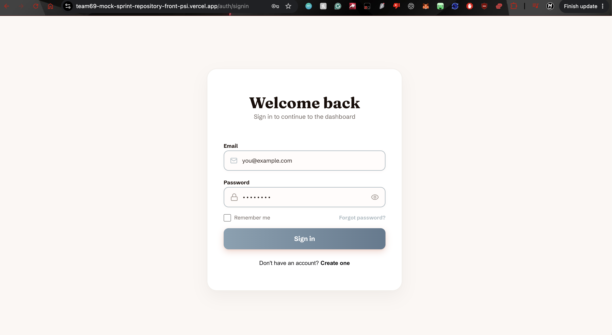

# Login Flow Testing 
**Sprint:** Mock Sprint - Bootstrap Restyling  
**Test:** Login and Team Page Edge Cases

## 1. Purpose 
This document records the edge case testing on the deployed Vercel URL.
The purpose of this test is to verift invalid login attempts, unauthorised Team Page access, missing team photos and unsually long blurbs.

## 2. Environment
Each test was conducted within the deployed Vercel application and the local deployment.

## 3. Test Results

### Invalid Login
**Result:** PASS
Invalid Login tested on deployed URL: Incorrect credentials were rejected with a pop-up message of "invalid email/password". Validation error messages were shown when either fields were blank.

### Tean Redirect
PASS: Direct team-page access without login tested. Redirects users to the sign in page.

### Missing Photo
**Result:** FAIL (NOW FIXED AND PASS)
Missing Photo: When changing the path of an avatar photo to make avatar unavailable, there is no placeholder avatar.
Expected: An avatar placeholder for the missing or invalid path
Actual: No placeholder for the invalid or missing path

There is now a placeholder image as it was 

### Unusually Long Blurb
**Result:** FAIL (NOW FIXED AND PASS)
Long-Blurb: Expected long text to wrap around and remain within the layout. However the actual long text wraps but then overflows over the card.
Expected: Expected long text to wrap around and remain within the layout.
Actual: The long text wraps however overflows over the card.

## 3. Overall Result
**Result:** PASS

